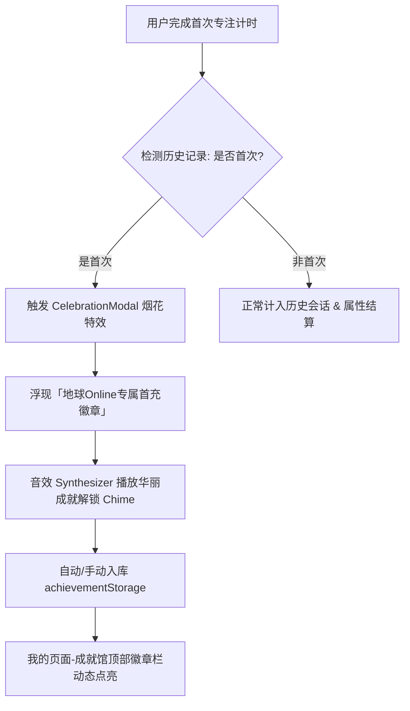

# 「首次专注里程碑」与「地球 Online」成就体系实施方案

本规划针对用户完成**首次番茄钟任务**时的“烟花庆祝 + 徽章浮现 + 自动入库我的成就”，并对成就馆顶部徽章栏及成就文案进行**“地球 Online”**沉浸式重塑。

---

## 一、 整体交互与数据闭环链路

1. **触发时机**：
   - 无论是倒计时自然结束，还是正向计时点击绿色勾完成结算；
   - 当 `db.pomodoro_sessions` 中 `mode === 'focus' && isCompleted === true` 的总次数为第 **1** 次时触发。
2. **轻量全屏烟花动效**：
   - 采用纯原生 HTML5 Canvas 粒子发射器，零额外 npm 依赖包，轻量且帧率达 60FPS。
   - 粒子搭配轻拟物柔和金、薄荷绿、暖橙色彩，呈现细腻梦幻的喷泉烟花与碎屑彩带。
3. **徽章浮现与收束动画**：
   - 屏幕中央伴随光晕展开轻拟物立体浮雕徽章。
   - 停留 3~4 秒（或点击任意处加速），徽章伴随缩放缓动收束至个人主页，并展示微弱飞入吸附动效。
4. **数据联动**：
   - 自动将成就数据更新至 [`achievementStorage.ts`](file:///c:/Users/Emily/Desktop/cloudfly-UI/轻拟物/src/core/rpg/achievementStorage.ts)。
   - 重构 [`AchievementSheet.tsx`](file:///c:/Users/Emily/Desktop/cloudfly-UI/轻拟物/src/components/apps/profile/components/AchievementSheet.tsx) 顶部徽章序列，由原来的硬编码（🐱/🦊/固定锁头）改为**动态读取真实成就状态**（已达成的显示发光徽章，未达成的显示青蓝锁气泡）。

---

## 二、 优缺点与边界分析

### 🌟 核心优势（优点）
1. **即时正反馈（Hook 机制）**：行为心理学中，用户在第一次投入注意力的时刻最需要“仪式感”激励。烟花与成就赋予了现实生活“玩游戏通关”的爽快感。
2. **打破应用孤岛**：将番茄钟（生产力工具）与个人页（RPG 成就系统）在底层真实贯通，使产品更具“拟物微操作系统”的整体生命力。
3. **“地球 Online” 情绪价值**：当代年轻人对枯燥的说教式“自律”感到麻木，而用“地球 Online 系统日志”的戏谑幽默口吻，既能消除压力，又具备极强的社交传播力。

### ⚠️ 潜在缺憾（注意事项与边界）
1. **阻断感控制**：弹窗必须支持“点击任意区域立刻关闭跳过”或几秒后自动淡出，不能强迫用户停留在弹窗里导致打断休息节奏。
2. **防重复触发**：必须在 IndexedDB / LocalStorage 中持久化 `hasUnlockedFirstFocusMilestone` 标志位，防止用户删了一条记录后反复弹窗引发疲劳。
3. **图文自洽性**：成就文案如果风格太分散（一会儿严肃、一会儿网梗），容易造成系统感割裂，需要定准基调。

---

## 三、 未来可扩展方向（Extension Ideas）

1. **现实主线衍生树（Skill Tree 联动）**：
   - 达成【首次专注】后，解锁后续分支：【连续三天上线】、【深夜潜行专注】、【双休日高难度攻坚】。
2. **系统补丁通知弹窗（Patch Note）**：
   - 达成特定重大成就时，以“地球 Online 临时热更补丁”形式弹出趣味说明（例如：*“检测到玩家神经元突触连接效率提升 12%，该 Buff 已永久生效”*）。
3. **成就徽章挂件上屏**：
   - 用户可挑选已获得的成就徽章，固定佩戴在个人档案主页或番茄钟表盘顶部的右上方胶囊位置。

---

## 四、 具体选择方向（请挑选您喜欢的风格）

### 选项 1：【系统日志 / 赛博观察员风】（推荐度 ⭐⭐⭐⭐⭐）
- **基调**：将现实生活视作一套庞大且神秘的碳基物理沙盒，系统以冷峻但幽默的“观察员日志”口吻记录。
- **代表命名**：
  - 首次专注徽章：**【协议激活：脑波超频】**（描述：首次脱离多巴胺闲散流，强制加载 25 分钟高算力进程）
  - 进阶成就：**【物理防沉迷突破】**（连续 4 个番茄钟）、**【现实世界隐身潜行】**（专注期间未切换任何应用）

### 选项 2：【MMORPG 戏谑废话风】（亲和力极强 ⭐⭐⭐⭐）
- **基调**：调侃“地球是个垃圾游戏，但我正在认真玩”，充满游戏玩家自嘲与反差萌。
- **代表命名**：
  - 首次专注徽章：**【新手教程跳过失败】**（描述：恭喜玩家完成强制主线新手引导，当前角色灵智 +1）
  - 进阶成就：**【多巴胺脱瘾初级体验】**、**【肝帝出巡·主城挂机退散】**、**【碳基生物开机自检成功】**

### 选项 3：【都市修仙 / 物理飞升风】（中二热血 ⭐⭐⭐⭐）
- **基调**：将日常自律与现代生活写成现代修真秘术，专注为“入定”，休息为“吐纳”。
- **代表命名**：
  - 首次专注徽章：**【凡胎入定·筑基初成】**（描述：万念归一，屏蔽世俗喧嚣 25 分钟，道心坚毅）
  - 进阶成就：**【结丹·神识外放】**、**【辟谷三巡·忘却摸鱼】**

---

## 五、 后续实施执行步骤

- **Step 1**：实现轻量原生粒子烟花发射器组件 `CelebrationModal.tsx`（包含拟物光晕与徽章浮现浮层）。
- **Step 2**：在 [`PomodoroApp.tsx`](file:///c:/Users/Emily/Desktop/cloudfly-UI/轻拟物/src/components/apps/pomodoro/PomodoroApp.tsx) 的完成结算钩子中注入初次判定逻辑。
- **Step 3**：重构 [`AchievementSheet.tsx`](file:///c:/Users/Emily/Desktop/cloudfly-UI/轻拟物/src/components/apps/profile/components/AchievementSheet.tsx) 顶部徽章序列为动态绑定，支持高亮展示新解锁徽章。
- **Step 4**：按您确认的“地球 Online”文案风格，批量更新 [`achievementTypes.ts`](file:///c:/Users/Emily/Desktop/cloudfly-UI/轻拟物/src/core/rpg/achievementTypes.ts) 中的预设成就与衍生关系。
