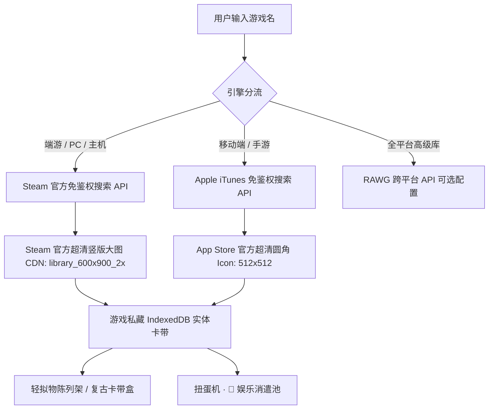

# 【游戏私藏 / 游乐手账】(GameVault) 实施方案

---

## 🎯 一、产品定位与核心目标

继 **【书藏】（纸质书籍空间与阅读进度）** 和 **【时光放映室】（电影票根与光影记录）** 之后，打造属于用户的第三座精神私藏馆 —— **【游戏私藏】（GameVault）**。

### 核心解决痛点：
1. **游戏太多无处整理**：Steam 买了上百个、Switch 买了几个卡带、手机里下了好几个手游，缺乏一个统一、治愈、高颜值的轻拟物空间进行集中归拢。
2. **“电子阳痿”与长草期抉择困难**：不知道今晚玩什么时，在各大平台刷来刷去，最后把时间浪费在无意义的信息流中。
3. **沉浸式通关仪式感**：打完一部神作（如《黑神话》、《艾尔登法环》、《塞尔达》），写下通关评语、记录时长与评分，形成数字化“游戏通关纪念卡带”。

---

## 🕹️ 二、技术架构与 API 选型方案

为保证**零成本、超快响应、无需复杂的第三方认证门槛**，采用**“双引擎免鉴权检索 + 可选 Steam 库同步”**策略：

### 1. 引擎 A：Steam 免鉴权搜索与高清海报（PC/端游）
- **搜索接口**：`https://store.steampowered.com/api/storesearch/?term={游戏名}&l=schinese&cc=CN`
  - 免 API Key、免鉴权、零门槛秒搜。
- **超清封面 CDN 规则**：
  - **竖版画廊海报（600x900）**：`https://shared.akamai.steamstatic.com/store_item_assets/steam/apps/{appId}/library_600x900_2x.jpg`
  - **横版胶囊海报（460x215）**：`https://shared.akamai.steamstatic.com/store_item_assets/steam/apps/{appId}/header.jpg`

### 2. 引擎 B：Apple iTunes 搜索（手游 iOS/Android）
- **搜索接口**：`https://itunes.apple.com/search?term={手游名}&entity=software&country=cn&limit=6`
  - 零门槛获取国内几乎所有官方手游（《原神》、《崩铁》、《明日方舟》、《金铲铲》等）的高清官方图标、开发商、分类标签及高清游戏截图。

### 3. 可选扩展：Steam 官方 Web API（个人库一键同步）
- 用户可在设置中填入个人 `SteamID64` 与 `Steam API Key`，一键拉取其账号所有拥有的游戏列表及总游玩时长（`playtime_forever`）。

---

## 🎨 三、轻拟物视觉与交互设计

遵循系统的**和果子 / 治愈系轻拟物**调性：

1. **游戏形态（两种视图自由切换）**：
   - **复古卡带模式（Cartridge Mode）**：卡带插槽、透明塑料保护盒光泽、微凸卡扣。
   - **画廊海报模式（Poster Mode）**：与【放映室】票根海报呼应的微阴影竖版大图。
2. **状态四分法**：
   - 🌟 **想玩（Wishlist）**：愿望单待开荒，标记心动期待指数。
   - 🎮 **在玩（Playing）**：推进中，记录当前进度/累计小时数。
   - 🏆 **通关（Cleared）**：全成就/打完主线，点亮白金通关印章，写下感言。
   - 💤 **封盘（Dropped）**：弃坑或吃灰，记录吃灰原因防冲动剁手。
3. **平台微标 Pill**：
   - `Steam` / `Switch` / `PlayStation` / `Xbox` / `iOS·手游` / `Android` / `PC`

---

## 🎡 四、与全系统生态深度联动

1. **扭蛋机联动**：
   - `src/components/apps/gachapon/core/gachaEntertainmentSync.ts`
   - 自动将 `status === 'wishlist' || status === 'playing'` 的游戏注入 **`🍿 娱乐消遣池`**。
   - 用户在扭蛋机抽到游戏后，卡片展示封面与游玩时长，点击 **`🎮 启动/记录游戏`** 一键唤醒【游戏私藏】。
2. **桌面图标与应用商店**：
   - 注册桌面图标 `gamevault`（复古黄色/薄荷绿卡带机掌机造型）。
   - 登入 `appStoreCatalog.ts` 随装随玩。
3. **地球 Online 联动**：
   - 通关游戏后判定相关生活技能或获得成就彩蛋。

---

## 📋 五、阶段化实施路径

| 阶段 | 交付物 | 详细内容 |
| :--- | :--- | :--- |
| **阶段 1：数据层** | `gameTypes.ts` + `db.ts` + `gameStorage.ts` | 创建 IndexedDB `games` 表，实现增删改查、统计分析及预置经典卡带数据 |
| **阶段 2：搜索服务** | `gameSearchService.ts` | 封装 Steam 官方免鉴权搜索与 iTunes 手游搜索双引擎，带缓存防频控 |
| **阶段 3：UI 核心组件** | `GameVaultApp.tsx` + `GameCard.tsx` + `GameEditModal.tsx` | 构建轻拟物卡带展架、分类标签过滤、搜索选择器、通关打分弹窗 |
| **阶段 4：系统注册** | `appStoreCatalog.ts` + `AppRenderer.tsx` + 图标 | 挂载桌面应用图标、路由穿梭唤醒 |
| **阶段 5：扭蛋池打通** | `gachaEntertainmentSync.ts` | 扭蛋机娱乐消遣池一键接入游戏，完成全闭环测试 |

---

## ❓ 确认与启动选项

请审阅以上设计方案，确认后我将为你分步实施！你希望：
1. **立即全速开启第一阶段（数据层与双引擎搜索服务）？**
2. **还是对视觉风格（如卡带样式、平台标签）有其他特定偏好？**
