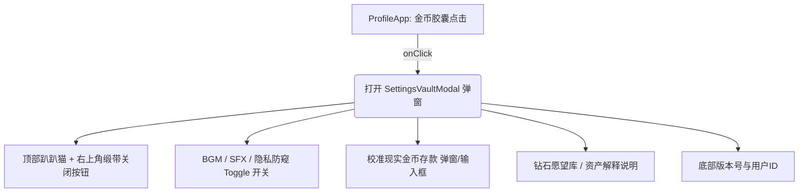

# 「金库与猫咪设定盒」设计与实现计划 (Implementation Plan)

用户提出：**“在等级旁边，点击金币的位置，跳出如图页面。我希望金币等于用户现实中的金钱存款。但我没想好钻石代表什么。”**

本文档深入剖析这一机制的**优点、缺憾、扩展可能性**，提供**钻石代表什么**的选择方向，并给出**精准对齐参考图美学**的完整落地方向供您决策。

---

## 一、方案深度剖析：优点、缺憾与扩展性

### 1. 核心优点 (Why it's awesome)
- **破次元的情感代入与强正向激励**：
  把枯燥、冰冷、甚至让人焦虑的银行卡余额或存款数字，搬进充满手绘温度与猫咪陪伴的轻拟物世界中。每一次现实中存下一笔钱，在小手机里看到金币上涨，会获得双倍的**“打怪积累战利品”**的真实成就感。
- **天然的冲动消费“紧箍咒”**：
  在现实中付款通常只是扫码、面容ID一响，毫无痛感；但在小手机里如果需要同步扣减金币，用户会直观看到角色资产缩水，产生“心疼小猫、心疼钱包”的自省机制，有效抑制冲动消费。
- **让轻拟物 OS 从“玩具”蜕变为真正的“人生操作系统”**：
  六维属性代表成长与能力，半生手账代表生命记忆，而金币代表现实物质支撑。整个小手机真正成为用户现实生活的映射载体。

---

### 2. 潜在缺憾与矛盾 (Pitfalls & Conflicts)
- **缺憾 1：系统自动化奖励与现实记账的“虚实冲突”**
  - *问题*：目前系统中背单词、读文章、完成任务会自动发放金币（例如读完一本书 `+100` 金币）。如果金币严格等于真实存款，系统凭空给用户发 100 金币，现实钱包并没有多出 100 元，会导致记账失真、数值混乱。
  - *解法*：
    - **解法 A（纯手动记账与校准模式）**：游戏内任务/阅读不再发放金币，而是发放**“经验值”**或**“钻石/心愿碎片”**；金币只能通过点击弹窗手动修改或记一笔收支。
    - **解法 B（零花钱/奖励金蓄水池模式）**：金币分为“总存款”与“本月可支配零花钱”，或者任务奖励的金币代表“今天奖励自己可以存入储蓄罐的现实小钱”（如奖励 5 元，现实中便存 5 元）。
- **缺憾 2：公共场合的财务隐私暴露风险**
  - *问题*：如果金币完全等于真实存款，在地铁、办公室打开轻拟物主界面时，大额存款数字直接暴露在顶部，会带来严重的隐私与安全焦虑。
  - *解法*：在参考图的弹窗中，增加原生的 **`Privacy (隐私遮罩)` 开关**（开启后金币显示为 `****` 或可爱猫爪遮挡，点击弹窗后才显现或长按显现）。
- **缺憾 3：大额现实支出带来的负罪感与负反馈**
  - *问题*：生病、交房租、还贷款导致金币断崖式下跌，容易把现实压力放大到虚拟治愈空间中。
  - *解法*：引入“开销归类”，将必要支出（如房租、健康支出）标记为“为生命/家园升级护盾”，而不是单纯的“资产流失惩罚”。

---

### 3. 可以怎么扩展 (Exciting Extensions)
1. **现实存钱打卡与存钱罐（Saving Goals）**：
   设定一个现实愿望（如“买新相机 8000元”、“去云南旅行 3000元”），金币每增加，愿望进度条就向前爬升，猫咪会给用户放烟花庆祝。
2. **存钱利息与被动收益彩蛋**：
   可根据现实余额（金币），每天北京时间结算微量“理财猫罐头”或“情绪收益”，模拟现实中的资产增值。
3. **极简收支流水便签**：
   在弹窗中点击金币可展开一张像咖啡馆收据一样的小票，只记大额存入（工资、奖金）和支出，不搞复杂的会计记账，保持轻松。

---

## 二、钻石代表什么？—— 4 个核心选择方向

既然金币代表**「现实流动资金 / 银行存款」**，那么钻石应该在体系中扮演什么角色？以下是 4 个非常契合的定位，供您选择：

| 选项 | 钻石代表的核心概念 | 现实对应物 | 优劣势与适配体验 |
| :--- | :--- | :--- | :--- |
| **方向 A（推荐）** **心愿奖励券 / 自律结晶** | **自己努力换来的无价自我犒劳积分** | 不可随意动用的“享乐与奖励额度” | **最优解**：解决虚实冲突！读书、自律、背单词奖励钻石，攒够 100 颗钻石可现实中兑换“奖励自己吃一顿大餐”或“看一场电影”，极具正向心流。 |
| **方向 B** **抗风险压舱石 / 长期硬核资产** | **固定资产 / 定期储蓄 / 黄金 / 理财投资** | 1 钻石 = 1,000元或10,000元不可动用资产 | 适合有理财习惯的用户：金币是随时可花的流动资金，钻石是长期底气（定期、理财、黄金、公积金）。双轨制资产表。 |
| **方向 C** **自由度（F.I.R.E. 自由天数）** | **能够支撑自己不上班自由生活的总天数** | 净资产 ÷ 每日基础生活成本 | 极具哲学意义：每一颗钻石代表“1 天自由人生”。金币增加或生活成本降低，钻石（自由天数）都会变多。 |
| **方向 D** **精神财富与灵感资产** | **读完的绝好书、去过的城市、重大成就** | 人生的高光记忆与心智成长资产 | 钻石只通过完成重大人生成就（如半生里程碑、读完一本厚书、完成高难挑战）获得，不可折算金钱，代表精神富足。 |

---

## 三、弹窗设计细节（精准复刻参考图美学）

点击等级旁边的**「猫爪金币胶囊」**（以及钻石胶囊），弹出一个如参考图所示的高精度手绘复古木质边框小面板：

### 1. 视觉结构精确对齐参考图：
1. **顶部趴伏猫猫（Cat Mascot）**：
   - 探出上半身的小白猫（带橘色猫耳、微眯享受的小眼神、肉垫搭在边框上，胸前带红领圈/苹果图案），原汁原味还原截图。
2. **右上角红色缎带关闭按钮（Ribbon Tab & Close）**：
   - 垂挂折角的暖红书签缎带，中间嵌有微圆角的奶白 `✕` 关闭按钮。
3. **主面板卡片底色与边框**：
   - 浅奶油羊皮纸底色（`#FFF8E7`）、复古深棕/暖红手绘勾边（`#502428`）。
   - 顶部手绘标牌字体：`Settings`（或 `Vault & Settings`）。
4. **两列复古胶囊滑动开关（Vintage Pill Toggles）**：
   - 第一排：`BGM` 开关（控制背景音乐） + `SFX` 开关（控制点击音效）。
   - 第二排：`Push`（或 `Privacy` 存款隐私防窥遮罩开关）。
   - 外观：暖橙色胶囊滑轨 + 复古草绿色圆纽，带深色描边与高光。
5. **绿色果冻圆角按钮（Glossy Jelly Buttons）**：
   - `Deposit`（校准金币 / 现实存款额度与修改）。
   - `Gems Vault`（钻石愿望金库 / 属性兑换）。
6. **珊瑚粉红色作者/自律横幅（Feature Banner）**：
   - 左侧为可爱的猫咪小头像，右侧为自定义励志手绘文案（如 `Omyo's Instagram` 或用户自定义的 `My Saving Goal: 50,000`）。
7. **底部复古打字机字样（Footer）**：
   - 左侧 `User ID : 417914`（支持读取或生成专属用户编号）。
   - 右侧 `Version : 1.23.0`。

---

## 四、拟修改与新增的文件结构

### 涉及的具体文件变更：
1. **[NEW] [SettingsVaultModal.tsx](file:///c:/Users/Emily/Desktop/cloudfly-UI/轻拟物/src/components/apps/profile/components/SettingsVaultModal.tsx)**:
   - 完整复刻参考图排版的弹窗组件。
   - 包含高保真 SVG 绘制的趴趴白猫、红书签关闭键、复古立体胶囊滑动开关、绿色果冻按钮与珊瑚粉横幅。
   - 提供金币/现实存款快速修改校准表单（支持输入真实金额，同步保存到 `profile.gold`）。
   - 提供隐私遮罩联动（开启后主页金币显示为 `****`）。
2. **[MODIFY] [ProfileApp.tsx](file:///c:/Users/Emily/Desktop/cloudfly-UI/轻拟物/src/components/apps/profile/ProfileApp.tsx)**:
   - 给猫爪金币胶囊添加 `cursor: pointer` 和 `onClick={() => setShowVaultModal(true)}`。
   - 支持防窥隐私模式（若开启，胶囊显示 `****`）。
   - 挂载 `SettingsVaultModal`。
3. **[MODIFY] [types.ts](file:///c:/Users/Emily/Desktop/cloudfly-UI/轻拟物/src/core/rpg/types.ts)**:
   - 在 `RPGProfile` 中增加 `isPrivacyHidden?: boolean; bgmEnabled?: boolean; sfxEnabled?: boolean;` 等设置项，持久化保存。

---

## 五、请您选择的方向（反馈确认）

在正式写代码前，请告诉我您的具体想法：

1. **钻石代表什么？**
   - **选择 1**：【方向 A】努力与自律换来的**“心愿奖励券”**（背单词、读书获得，用于兑换现实中的吃喝玩乐奖赏）。
   - **选择 2**：【方向 B】现实中的**“长期压舱石资产”**（定期存款、理财、黄金、大额理财折算，与活期现金金币区分）。
   - **选择 3**：【方向 C】**“F.I.R.E. 自由人生天数”**（现实资产换算出的不用上班天数）。
   - **选择 4**：或者您已有自己的定义？

2. **金币（现实存款）的变动机制：**
   - 游戏中背单词、读文章是**仅奖励钻石/经验**（纯净真实记账），还是**依然给微量金币**？
   - 弹窗内的绿色按钮，您希望一个是“修改真实存款”，另一个是？

3. **关于参考图弹窗的文案与开关：**
   - 是否严格保留参考图中的 `BGM`、`SFX`、`Push`（或换成 `Privacy 隐私防窥`）？
   - 珊瑚红横幅区域您希望写什么（保留原样小猫彩蛋，还是放存钱目标语）？

期待您的决策，收到回复后我将立即开始执行！
